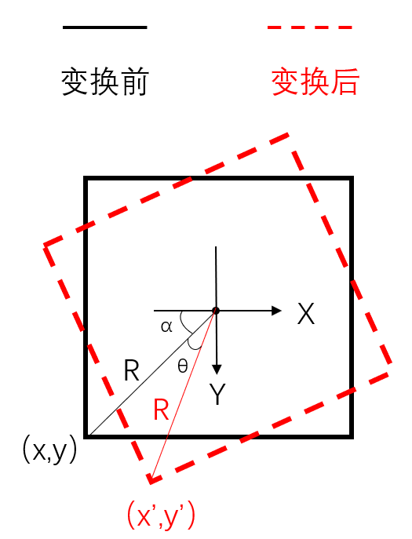
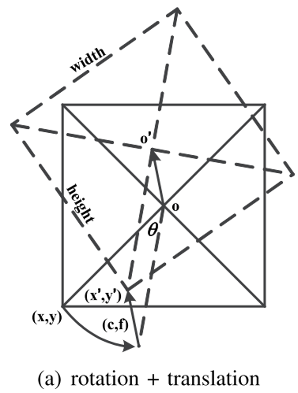
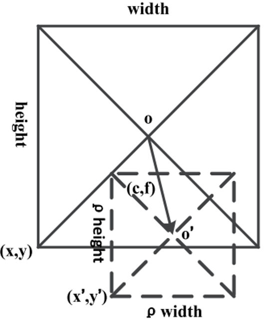
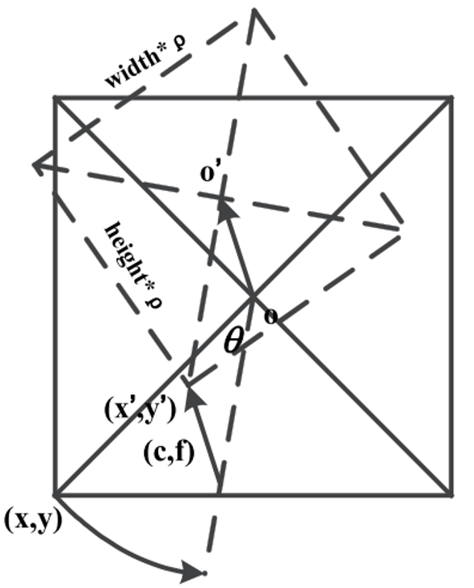
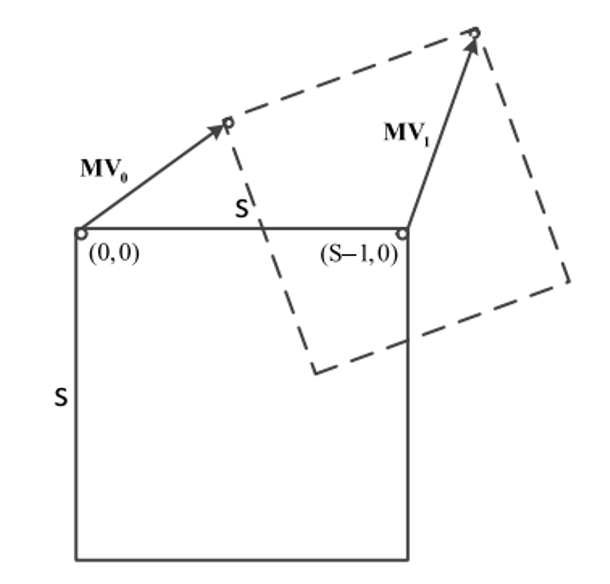
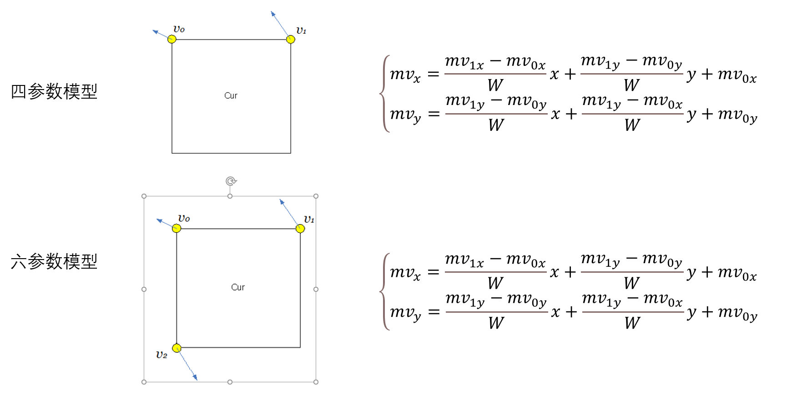
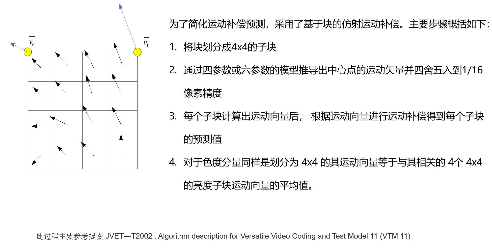

# 前言
VVC帧间编码中，最吸引人的工具莫过于仿射。笔者近期在实验室的Cmodel上开发了仿射运动补偿工具，学习中的所思所想在此记录，供大家参考。
# 仿射运动补偿
  VVC中仿射这个工具的名字叫做仿射运动补偿(Affine Motion Compensation，AMC)。从名字中可以看出，该工具最大的收益是作用于运动补偿，获得更好的预测效果。实际上该工具在视频编解码领域研究热度一直高，但是如何将仿射变换与视频编解码结合一直阻碍着该工具在编解码领域的应用。随着[《ControlPoint_Representation_and_Differential_Coding_Affine-Motion_Compensation》](https://ieeexplore.ieee.org/document/6488797)、[《An_Efficient_Four_Parameter_Affine_Motion_Model_for_Video_Coding》](https://ieeexplore.ieee.org/document/7914636)、[《An Improved Framework of Affine Motion Compensation in Video Coding》](https://ieeexplore.ieee.org/document/8502099)等工作的发表。将仿射参数用CU角点处的运动矢量进行表示，通过AMVP或者Merge的方式传输这些运动矢量使得仿射运动完美的融入到了视频编解码框架中。至此，VVC中成功集成了仿射运动工具。
# 仿射变换
  以往标准里的帧间工具只能对平移运动进行描述，而对旋转、缩放和拉伸等复杂的运动情景没能很好的建模，为了提高预测的准确性，就提出了仿射变换这一高阶运动模型。
## 旋转

    
     
    

    旋转示意图
  	

  对于上图所示的旋转运动：在图像块中心建立极坐标系，则图像块中每个像素点的坐标（X，Y）分别等于
  $$ \begin{cases}
      𝑋=𝑅∗cos⁡α \\
      𝑌=𝑅∗sin⁡α
    \end{cases}
  $$ 
  经过θ角度的旋转。新图像块中的坐标（X’,Y’）分别等于
  $$ \begin{cases}
      𝑋^′=𝑅∗cos⁡(α+θ) \\
      𝑌^′=𝑅∗sin⁡(α+θ)
    \end{cases}
  $$ 
  新旧坐标之间的关系为：
  $$ \begin{cases}
      𝑋^′=cos⁡(θ)∗𝑋 +sin⁡(θ)∗𝑌\\
      𝑌^′=−sin⁡(θ)∗𝑋+cos⁡(θ)∗𝑌
    \end{cases}
  $$ 

在旋转运动中，如果知道旋转前像素的坐标（X，Y）以及旋转角度θ。便可得到旋转后的像素坐标。

## 旋转 + 平移

    
     
    

    旋转+平移示意图
  	

  考虑上面的旋转运动加上平移运动，变换前后的图像块中的坐标之间的关系为：
  $$ \begin{cases}
      𝑋^′=cos⁡(θ)∗𝑋 +sin⁡(θ)∗𝑌 + c\\
      𝑌^′=−sin⁡(θ)∗𝑋+cos⁡(θ)∗𝑌 + f
    \end{cases}
  $$ 
在旋转+平移变换中，如果知道旋转前像素的坐标（X，Y）,旋转角度θ和平移运动参数c,f。便可得到旋转后的像素坐标。

## 旋转 + 平移

    
     
    

    缩放+平移示意图
  	

  考虑到缩放加上平移运动，变换前后的图像块中的坐标之间的关系为：
  $$ \begin{cases}
      𝑋^′=\rho ∗ 𝑋 + c \\
      𝑌^′=\rho ∗ 𝑌 + f
    \end{cases}
  $$ 
  在缩放+平移变换中，如果知道旋转前像素的坐标（X，Y）,旋转角度θ和缩放运动参数 $\rho$ 。便可得到旋转后的像素坐标。

## 旋转 + 平移 + 缩放

    
     
    

    旋转 + 平移 + 缩放示意图
  	

  考虑到旋转 + 平移 运动，变换前后的图像块中的坐标之间的关系为：
  $$ \begin{cases}
      𝑋^′=cos⁡(θ)∗𝑋 +sin⁡(θ)∗𝑌 + c\\
      𝑌^′=−sin⁡(θ)∗𝑋+cos⁡(θ)∗𝑌 + f
    \end{cases}
  $$ 
  再加上缩放运动：
  $$ \begin{cases}
      𝑋^′=\rho*cos⁡(θ)∗𝑋 +\rho*sin⁡(θ)∗𝑌 + c\\
      𝑌^′=−\rho*sin⁡(θ)∗𝑋+\rho*cos⁡(θ)∗𝑌 + f
    \end{cases}
  $$ 
  旋转 + 平移 + 缩放变换中，如果知道旋转前像素的坐标（X，Y）,旋转角度，和缩放运动参数 $\rho$和平移运动参数c,f。便可得到旋转后的像素坐标。

  上述是仿射变换公式推导。主要参考了[《An_Efficient_Four_Parameter_Affine_Motion_Model_for_Video_Coding》](https://ieeexplore.ieee.org/document/7914636)。

# VVC中的仿射变换模型
  上面介绍了仿射变换的推导。可仿射变换怎么与视频编解码中的运动矢量建立起联系呢？首先视频编解码中的运动矢量其实是像素位置的变化，如果把变换前后的位置坐标做差，就得到了运动矢量！

  

    
     
    

    VVC中的仿射运动模型
  	

  

  去掉琐碎的辅助线，仿射运动如图所示。仿射变换前后像素的运动矢量MV为

  $$ \begin{cases}
      MV^X = 𝑋^′-X\\
      MV^Y = Y^′-Y\\
    \end{cases}
  $$ 
在前面的推导中，我们知道：
  $$ \begin{cases}
      𝑋^′=\rho*cos⁡(θ)∗𝑋 +\rho*sin⁡(θ)∗𝑌 + c\\
      𝑌^′=−\rho*sin⁡(θ)∗𝑋+\rho*cos⁡(θ)∗𝑌 + f
    \end{cases}
  $$ 

上面两个公式结合，我们可以得到：
  $$ \begin{cases}
      MV^X = 𝑋^′-X = aX+bY+c\\
      MV^Y = Y^′-Y = -bX+aY+f\\
    \end{cases}
  $$ 

其中：$a = 1- \rho*cos⁡(θ)$, $b = \rho*sin⁡(θ)$, c和f是平移运动参数。
至此，仿射参数成功与运动矢量呼应上了，上述公式表明：**假如我们知道像素的位置以及仿射参数。就可以得到该像素的运动矢量!** 反过来,假如我们知道像素的位置以及运动矢量。就可以得到仿射运动参数.然而，仿射参数有四个（VVC中也用了六参数仿射变换，这里仅以四参数为例介绍）,只有一个点的运动矢量无法求得运动参数。现在，我们把目光放在角点上。假设当前块左上角和右边上角点处的运动矢量已经知，分别是:$MV_0$和$MV_1$.那么就可以得到仿射运动参数a,b,c,f:
  $$
    \begin{cases}
      a = \frac{  MV_1^Y -MV_0^Y}{S-1}\\
      b = -\frac{  MV_1^X -MV_0^X}{S-1}\\
      c = MV_0^Y \\
      f = MV_0^X
    \end{cases}
  $$
  其中的S-1是图像块的宽（也就是位置信息）。至此就得到了JVET-T2002中所说的四参数仿射运动模型（六参数模型同理，多了更多的仿射参数，表示起来需要三个角点处的运动矢量）

  

    
     
    

    JVET-T2002中的仿射运动模型
  	

  

# 仿射运动补偿过程

  

    
     
    

    仿射运动补偿过程
  	

  

当得到了角点处的运动矢量$MV_0$ 和 $MV_1$后，根据JVET-T2002中的仿射运动模型，可以求出图像块中任意像素点的运动矢量，（这里遵循这样一个条件：该图像块中所有像素点进行了相同的仿射变换，也即拥有相同的仿射参数，也就是该图像块角点处的MV）。在实际的运动补偿过程中，为了降低仿射运动补偿的复杂度（主要是硬件中读取参考像素的带宽），没有将每一个像素点都计算出运动矢量进行运动补偿，而是每4x4小块拥有一个运动矢量来进行运动补偿。

# 讨论
1. 极端些说，如果帧间以像素级传输运动信息，每个像素点都能获得最佳的运动矢量进行运动补偿，VVC中很多新工具，AMC，Merge mode with MVD (MMVD)，Bi-directional optical flow(BDOF)，Decoder side motion vector refinement(DMVR)，Geometric partitioning mode（GPM）等工具将不复存在。虽然VVC帧间新工具五花八门，处了AMVR，其余工具都是一个目的:__减少残差的码率__。仿射变换，高阶运动模型是对于仿射运动补偿这个工具赞美。它为4x4的子块分配一个MV来获取更好的预测效果，却不用承担编码4x4子块MV的码率代价，是该工具增益的根本来源。而在AV1标准中，仿射运动补偿工具做到了每个像素分配了一个运动矢量，但是为了降低硬件实现复杂度，每个像素的运动矢量还是不能超过平移运动下运动矢量的正负1个整数像素
