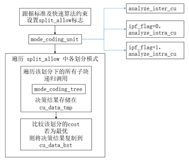
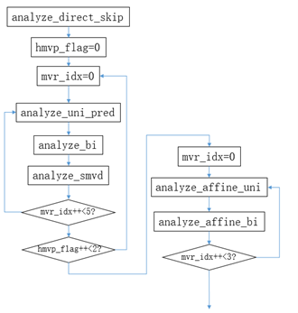
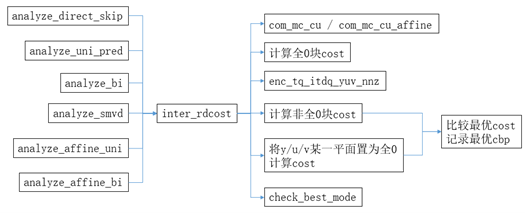

# 前言
SVAC3标准是在AVS3标准上开发的，其代码结构与AVS3对应的代码结构相似，下面内容参考了AVS3开源编码器器“天枢”的相关文档，这里主要记录CU帧间编码相关代码结构。
# mode_coding_tree
  mode_coding_tree()函数为编码树递归函数，其内部基本过程为：1. 确定可用的划分和不划分方式；2. 不划分如果可用，调用mode_coding_unit()进行CU的模式决策；3. 遍历其他可用的划分方式，对每一个划分方式，遍历每一个子块，递归调用mode_coding_tree()。
mode_coding_unit()函数为编码一个CU，内部尝试决策inter以及ipf标志为0和1时的intra模式。如果当前模式为最优，则将当前CU对应com_mode_t对象中存储的编码信息拷贝到enc_cu_t对象中。
。

    
     
    

    mode_coding_tree主要过程
  	

# CU帧间编码

帧间编码函数ananlyze_inter_cu() 基本过程如下图。首先尝试Direct和Skip模式，然后跟据hmvp_flag和mvr_idx不同的值，多次尝试单向、双向及SMVD模式编码。最后跟据mvr_idx不同的值，多次尝试affine的单向和双向编码。
其中，hmvp_flag为0时，不同的mvr_idx对应AMVR工具不同的运动矢量精度；hmvp_flag为1时对应EMVR编码工具，此时mvr_idx同时指定了对应的运动矢量精度及hmvp历史运动矢量。
	此外，analyze_direct_skip()函数中，会将所有可能的运动矢量导出方式均尝试一遍，通过satd选出N个最优的候选，最后对挑选出的候选进行RDO决策。

    
     
    

    ananlyze_inter_cu函数主要过程
  	

对于所有的帧间模式，最后均调用inter_rdcost()进行RDO，计算率失真代价。Inter_rdcost()函数的基本流程如下图所示。首先进行MC得到预测块，然后计算得到全0块的RDCost。再进行变换量化，反量化反变换得到重建块，若y/u/v三个非全为0，则计算RDCost，并同全0块RDCost比较，记录最优RDCost和CBP。进一步将y/u/v逐一置为全0，计算RDCost，并比较和记录最优RDCost和CBP。最后调用check_best_mode()，将该模式最优RDCost同先前尝试的模式进行比较，记录最优RDCost和编码信息。

    
     
    

    Inter_rdcost函数主要过程
  	

# CU帧间编码
Svac3 中插值默认是汇编加速了，可以在com_typedef.h的512行进行修改，恢复到C的过程